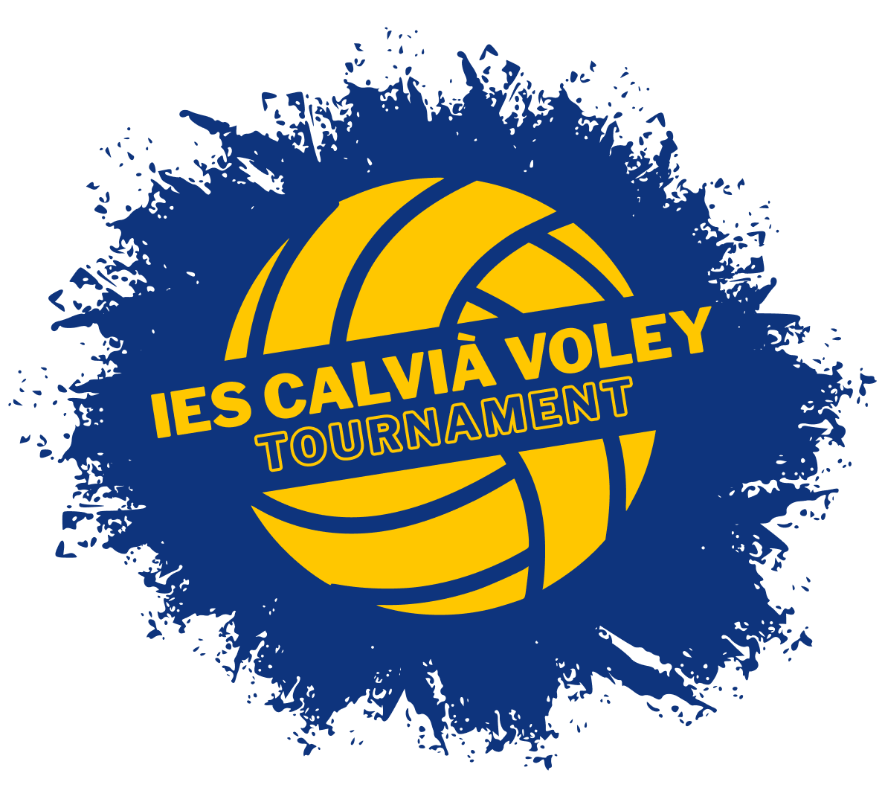
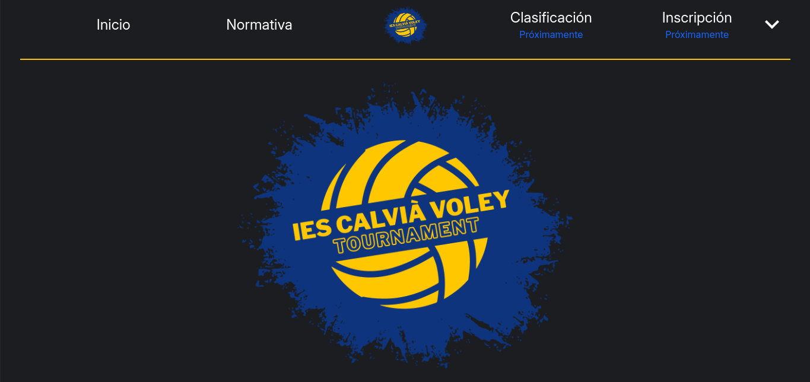

# IES Calvia Voley Tournament 

Bienvenido a la página oficial del **IES Calvia Voley Tournament**, el torneo de voleibol que se celebra en el IES Calvia. Este evento reúne a equipos de distintas cursos en un ambiente competitivo y emocionante.

## Información del Torneo

- **Nombre:** IES Calvia Voley Tournament
- **Fecha:** Próximo evento en la fecha especificada
- **Horario:** 9:00 a 13:45
- **Lugar:** Pabellon Galatzo
- **Número de pistas:** 2

### Objetivo

Fomentar la participación, la deportividad y la diversión entre los equipos locales e invitados, en un torneo donde se ponen a prueba habilidades y trabajo en equipo.

## Características de la Web

- **Información del Torneo:** Incluye detalles del evento, como la fecha, la ubicación y las reglas básicas.
- **Listado de Equipos:** Muestra los equipos inscritos con detalles de cada equipo, incluyendo nombre, escudo, capitán y lista de jugadores.
- **Horario de Partidos:** Programa de los partidos organizados por franjas horarias y pistas.
- **Clasificación en Vivo:** Clasificación de los equipos actualizada en tiempo real a medida que se desarrollan los encuentros.
- **Galería de Imágenes:** Sección dedicada a fotos de los partidos y momentos destacados del torneo.

## Tecnologías Usadas

- **Frontend:** HTML, CSS, JavaScript
- **Estilos:** Tailwind CSS
- **Backend:** Node.js
- **Librerías y Herramientas:** 
  - Astro para generación estática
  - Herramientas para manejo de estados y animaciones de interfaz
  - Typscript

